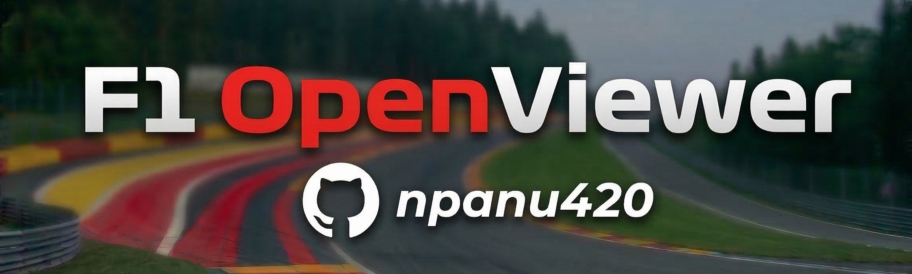
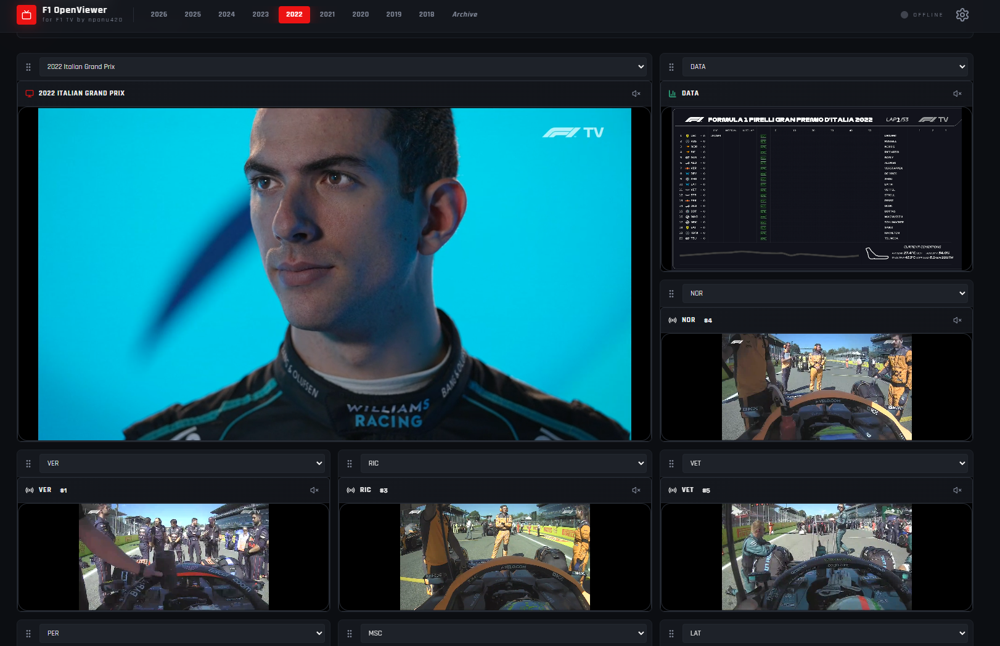
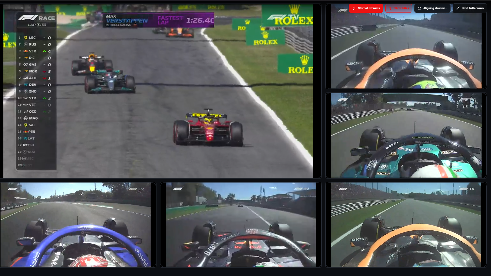
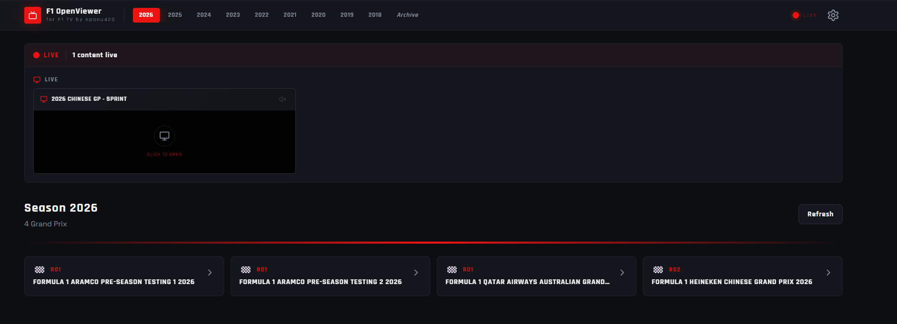

# 

# F1 OpenViewer by npanu420
Official login, entitlement, and DRM (Widevine) playback in an Electron app. Authorized access only — no piracy.

**Detailed setup instructions:** [docs/SETUP.md](docs/SETUP.md) — clone, configure `.env`, run in dev, build and sign.

For **build and signing** (code signing, Widevine VMP, certificates): [docs/BUILD_SIGNING.md](docs/BUILD_SIGNING.md).

---

## What it does

- **Authorized access** — Sign in with your F1 TV account (email/password, token, or in-app browser login).
- **DRM playback** — Stream protected content via Widevine CDM in a compliant way.
- **No unauthorized content** — No keys, bypasses, or stream sharing.

---

## Tech stack

- **Electron** (Castlabs fork for Widevine) — desktop shell, CDM handling, IPC to avoid CORS.
- **React + Vite** — UI.
- **Shaka Player** — DASH/HLS and Widevine DRM.
- **Unofficial F1 TV APIs** — login at `api.formula1.com`, catalog/playback via `@exhumer/f1tv-api` (f1tv.formula1.com).

---

## Requirements

- **Node.js** (LTS recommended)
- **Valid F1 TV subscription**
- **Windows** (Widevine path is documented for Windows; other OS may need manual CDM setup)

---

## Screenshots

Main Grid UI:

---

Fullscreen view:

---

Home with Live Event:

---

## Roadmap

1. **Login / Auth** (Milestone 1) — Done: login UI, session token in memory, network layer.
2. **Entitlement / Licenses** (Milestone 2) — Entitlement, asset/manifest selection, permissions and expiry.
3. **DRM playback** (Milestone 3) — End-to-end playback with real licenses.
4. **UI and UX improvements** — New UI and better UX 
5. **Live Timing** — Live Timing support for lives and replays **--WE ARE HERE--**

---

## Contact Me

- Github: github.com/npanu420
- Discord: @Ovetto

---

## Disclaimer & Legal Notice
Please read carefully before using or contributing to this project.

This project is a strictly non-profit, educational, and open-source endeavor developed solely by a university student for academic research purposes. The primary goal of this software is to study modern desktop streaming architectures, hybrid web-desktop frameworks (Electron/React), and the secure implementation of Digital Rights Management (DRM) technologies.

No Piracy or Paywall Bypass: This application does NOT provide free access to Formula 1 broadcasts. It is fundamentally impossible to watch any live or on-demand session without authenticating via a legally purchased, active, and valid F1 TV Pro or Premium subscription.

Strict DRM Compliance: This client does not decrypt, rip, record, or bypass any video protection mechanisms. It utilizes Google's certified Widevine Content Decryption Module (CDM) to legally and securely request and play the encrypted video streams (DASH/HLS), exactly as the official web player does.

No Geoblocking or VPN Bypass: This software does not alter or mask your location. The official F1 TV servers enforce all regional restrictions and blackout rules based on your network IP during the entitlement process.

Zero Commercial Intent: This project is 100% free, open-source, and contains no advertisements, telemetry, or monetization schemes of any kind.

Trademarks and Copyright:
This is an unofficial, community-driven academic project. It is not affiliated with, endorsed by, or sponsored by Formula One Digital Media Limited, Formula One Management, or any of their partners. "F1", "FORMULA 1", "F1 TV", and related marks are registered trademarks of Formula One Licensing B.V. All rights to the broadcast content, data, and official branding remain the exclusive property of their respective owners.

If you represent Formula One Digital Media Limited and have any concerns regarding this educational project, please contact me directly, and I will promptly address them or remove the repository.

### AI Disclaimer

AI was used in this project for **repetitive code** (e.g. login flows and boilerplate) and, in particular, for **translating the application, READMEs and code comments into English** so that documentation and code are easier to understand for everyone. Core logic and architecture remain human-authored.

---

## License

MIT — see [LICENSE](LICENSE).
