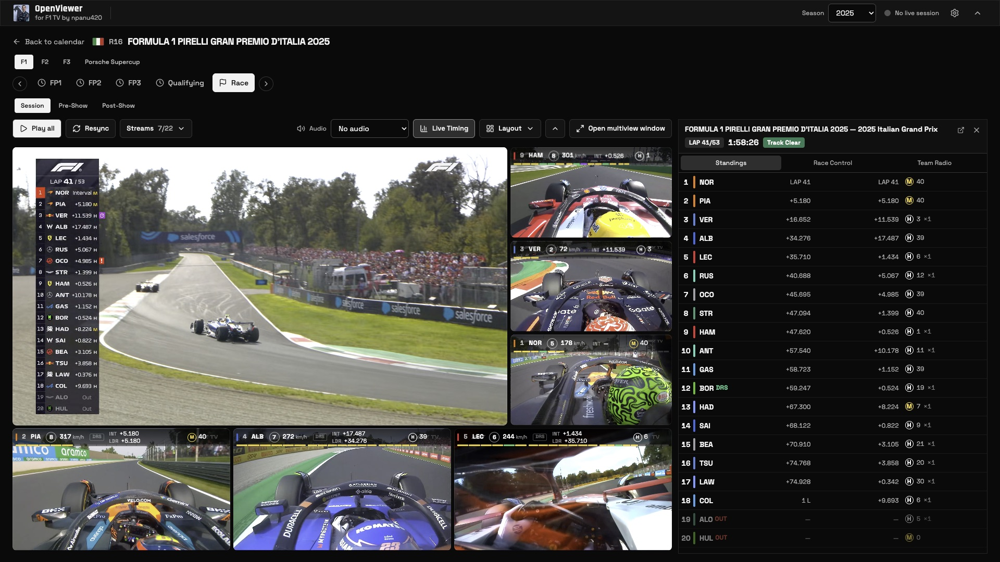
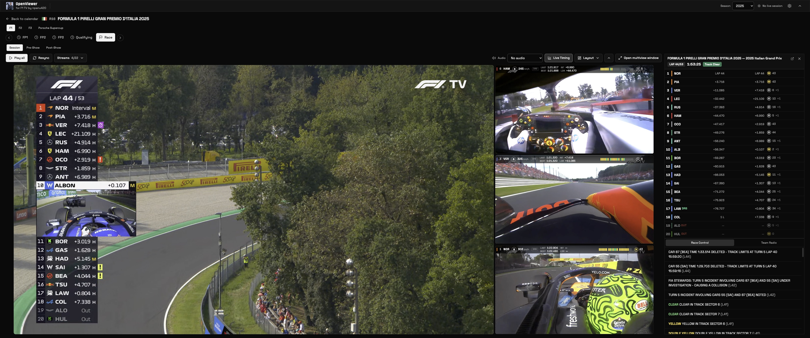
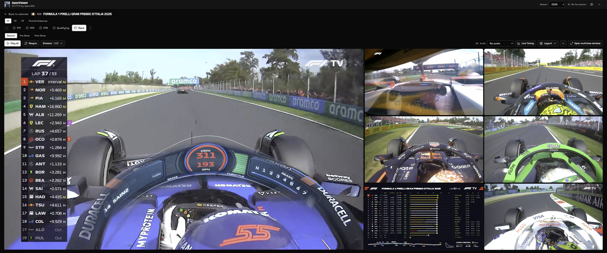
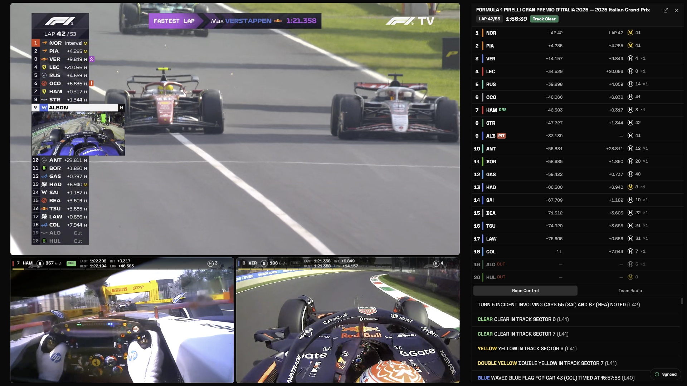
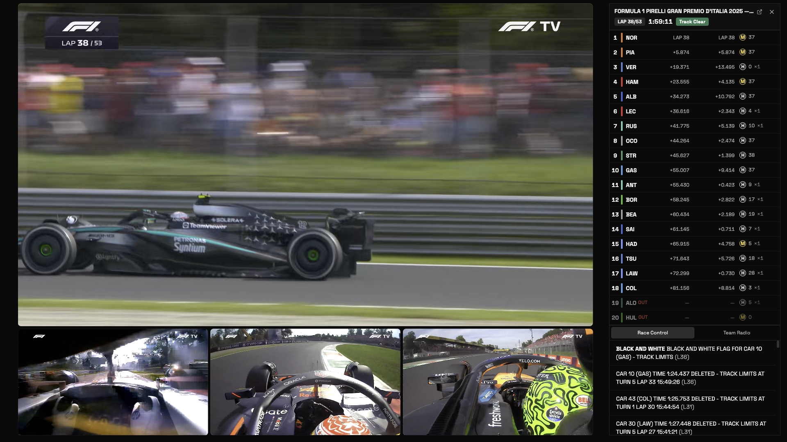
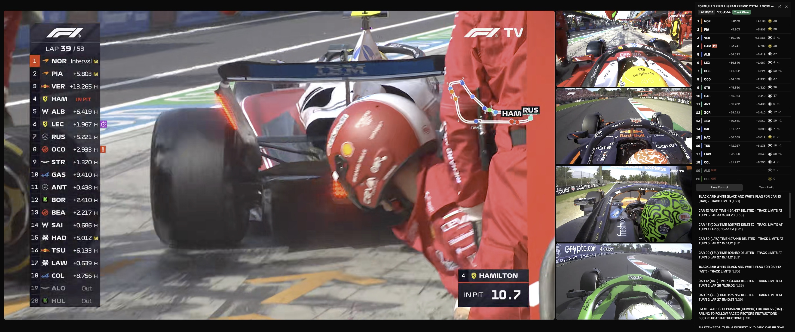
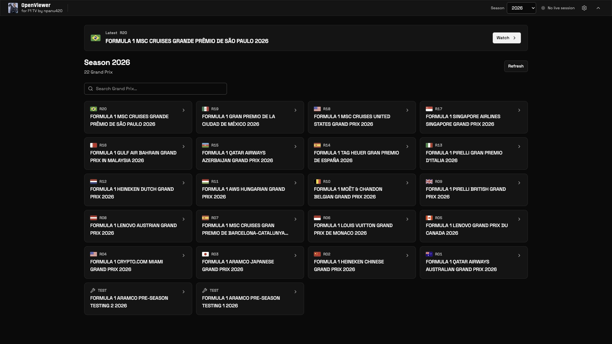
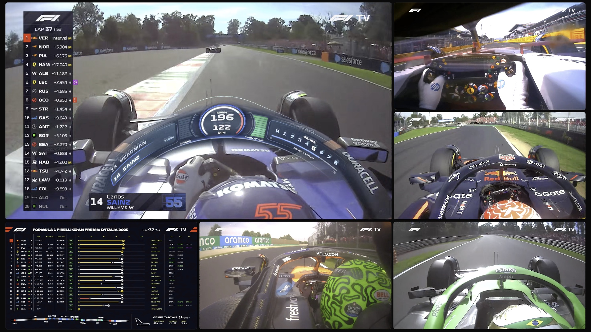
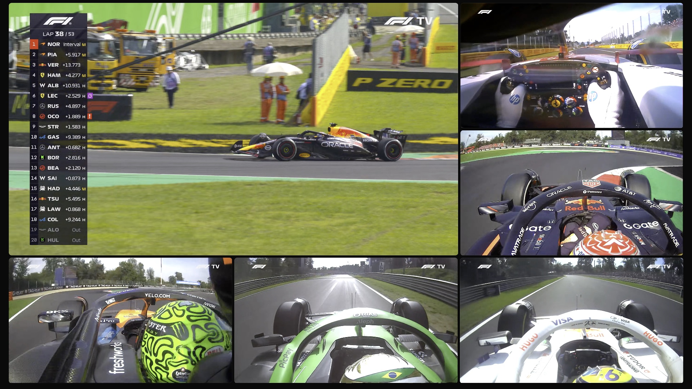
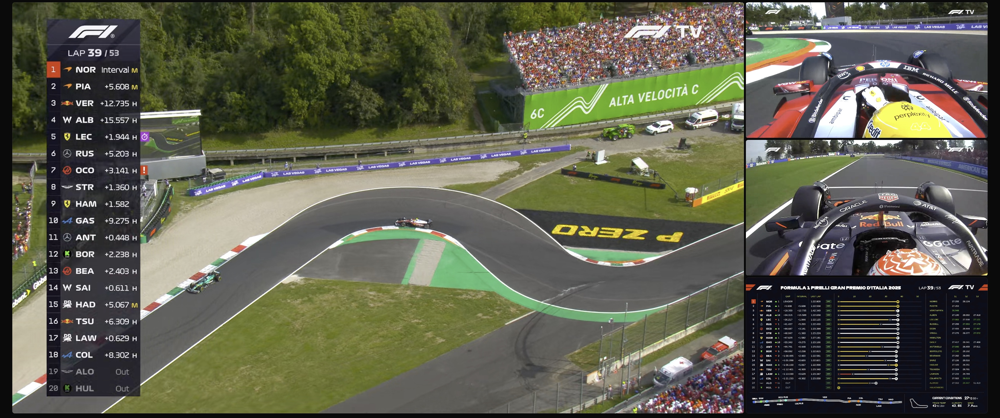

# OpenViewer by npanu420

A desktop app for watching F1 TV in a multiview grid with synchronized live timing. It uses the official login, entitlement and Widevine DRM playback. Authorized access only, no piracy.

*The auto layout following the window, with Live Timing and the driver HUD. [Watch the full video](docs/media/auto-layout-demo.mp4).*

## Documentation

- [Setup](docs/SETUP.md): clone, configure `.env`, run in development, build and sign.
- [Build and signing](docs/BUILD_SIGNING.md): code signing, Widevine VMP, certificates.
- [Release notes](docs/RELEASE_NOTES.md): what changed in each version.

## Contents

- [What it does](#what-it-does)
- [Live Timing](#live-timing)
- [Privacy & security](#privacy--security)
- [Tech stack](#tech-stack)
- [Requirements](#requirements)
- [Screenshots](#screenshots)
- [Contact](#contact-me)
- [Disclaimer & Legal Notice](#disclaimer--legal-notice)
- [License](#license)

---

## What it does

- **Authorized access**: sign in with your F1 TV account (email and password, token, or in-app browser login).
- **DRM playback**: protected content is played through the Widevine CDM, the same way the official player does.
- **No unauthorized content**: no keys, bypasses or stream sharing.

### Highlights

- **Auto layout that fills any screen.** Every tile is exactly 16:9, so there are no black bars, and the number of streams follows the window. The main feed stays the big tile, favourite drivers come next, and ultrawide monitors are filled edge to edge. Remove, add or swap panels by hand, save layouts you like, or pop the whole multiview out into its own window.
- **A layout that follows the race.** With live timing available, onboards of drivers who retire or are knocked out leave the layout by themselves, and the free tiles go to the cars at the front.
- **Driver HUD on onboards.** Position, speed, gear, DRS (for seasons that have it), lap times, gaps, mini-sectors and the tyre, with the full stint history on hover. It works in replays, in the Live Timing dock and in the multiview window.
- **Everything stays in sync, automatically.** In multiview, the main feed, onboards and data channel are continuously locked to each other. The sync engine anchors on the race feed and keeps correcting the rest (a seek if the drift is large, subtle playback-rate nudges if it is small), so onboards never quietly drift ahead or behind. If the main feed rebuffers, everything else waits for it instead of running away.
- **Live Timing synced to the video, not just running alongside it.** Standings, gaps, sector times, tyre stints, race control messages and team radio line up automatically with the moment you are watching in the replay, with no manual alignment.
- **Live-edge playback.** Live sessions track the live edge instead of drifting behind like a plain HTML5 video.
- **Customizable.** Video quality, live delay target, an experimental closest-to-live mode, buffer size, auto sync, how fast the controls hide and more are in Settings. The interface is available in English and Italian, with French, German and Spanish in progress.

---

## Live Timing

Live Timing opens in a dock beside the session, or in its own window, and shows the same kind of data as the official timing screen: standings, gaps, sector times, tyre stints, race control messages and team radio clips.

| Standard width | Ultrawide |
|---|---|
|  |  |

It runs on a public F1 archive that has nothing to do with F1 TV or DRM, so it does not need you to be logged in. The only login in this app is still the one for video playback.

**VPN note (Windows).** Live Timing is not georestricted, but its host blocks many VPN exit IPs at the WAF level. On Windows the app fetches the archive through the system `curl.exe` instead of in-process, so that a full-tunnel VPN (for example NordVPN) can split-tunnel by excluding just `curl.exe`: Live Timing then leaves on your real IP while everything else stays on the VPN. If your VPN client only supports app-based split tunneling, add an exclusion rule for `C:\Windows\System32\curl.exe`.

Live sessions are supported too, and the feed reconnects by itself if the connection drops. F1 TV live video lags the timing feed by tens of seconds, so the timing screen can show things the video has not reached yet.

Aligning the archive and the video used to be a manual step, because their clocks are not synchronized. Now the app fetches the correct offset automatically when you start a session. If that lookup fails or the session is unsupported, you can still align them manually from the sync menu, by selecting the lap shown on screen or nudging the offset.

---

## Privacy & security

- No telemetry, no analytics, no ads. Your F1 TV token and cookies stay on your machine, encrypted with the OS keystore.
- Besides F1's own services, the app only talks to a public video-to-timing sync offset service, `api.openf1.org` (driver headshots) and GitHub (once per launch, to look for a newer release).
- The packaged app ships a Content-Security-Policy, only ever shows its own document, and its local license proxy needs a per-launch secret. The playback windows still run with relaxed web security because F1's CDN and DRM requests need it. Details are in [docs/KNOWN_BUGS.md](docs/KNOWN_BUGS.md).
- Found a vulnerability? See [SECURITY.md](SECURITY.md).

---

## Tech stack

| Layer | Technology |
|---|---|
| Desktop shell and DRM | **Electron** (Castlabs fork for Widevine), CDM handling, IPC to avoid CORS |
| UI | **React** and **Vite** |
| Playback | **Shaka Player** for DASH, HLS and Widevine DRM |
| Storage | Account token and cookies encrypted at rest with the OS keystore (Electron `safeStorage`); settings in a JSON file under the app data folder |
| Fonts | Bundled locally (`@fontsource`), no requests to Google at runtime |
| Data | Unofficial F1 TV APIs: login at `api.formula1.com`, catalog and playback through an in-house client (`electron/f1tvapi.js`, MIT) against f1tv.formula1.com |

---

## Requirements

- **Node.js** (LTS recommended)
- **A valid F1 TV subscription**
- **Windows or macOS**: both are supported for build and Widevine DRM playback. See [docs/SETUP.md](docs/SETUP.md) and [docs/BUILD_SIGNING.md](docs/BUILD_SIGNING.md) for the per-OS Widevine CDM path and the signing steps. Other platforms may need manual CDM setup.

---

## Screenshots

| | Standard (1920 x 1080) | Ultrawide (3440 x 1440) |
|---|---|---|
| **Session view with the auto layout** |  |  |
| **Controls hidden, with the timing dock** |  |  |
| **Multiview window with Live Timing** |  |  |

More screenshots

---

## Contact Me

- Github: github.com/npanu420
- Discord: @Ovetto

---

## Disclaimer & Legal Notice

Please read carefully before using or contributing to this project.

This project is a strictly non-profit, educational, and open-source endeavor developed solely by a university student for academic research purposes. The primary goal of this software is to study modern desktop streaming architectures, hybrid web-desktop frameworks (Electron/React), and the secure implementation of Digital Rights Management (DRM) technologies.

- **No Piracy or Paywall Bypass**: This application does NOT provide free access to Formula 1 broadcasts. It is fundamentally impossible to watch any live or on-demand session without authenticating via a legally purchased, active, and valid F1 TV Pro or Premium subscription.
- **Strict DRM Compliance**: This client does not decrypt, rip, record, or bypass any video protection mechanisms. It utilizes Google's certified Widevine Content Decryption Module (CDM) to legally and securely request and play the encrypted video streams (DASH/HLS), exactly as the official web player does.
- **No Geoblocking or VPN Bypass**: This software does not alter or mask your location. The official F1 TV servers enforce all regional restrictions and blackout rules based on your network IP during the entitlement process.
- **Zero Commercial Intent**: This project is 100% free, open-source, and contains no advertisements, telemetry, or monetization schemes of any kind.
- **Trademarks and Copyright**: This is an unofficial, community-driven academic project. It is not affiliated with, endorsed by, or sponsored by Formula One Digital Media Limited, Formula One Management, or any of their partners. "F1", "FORMULA 1", "F1 TV", and related marks are registered trademarks of Formula One Licensing B.V. All rights to the broadcast content, data, and official branding remain the exclusive property of their respective owners.

If you represent Formula One Digital Media Limited and have any concerns regarding this educational project, please contact me directly, and I will promptly address them or remove the repository.

### AI Disclaimer

AI was used in this project for **repetitive code** (e.g. login flows and boilerplate) and, in particular, for **translating the application, READMEs and code comments into English** so that documentation and code are easier to understand for everyone. Core logic and architecture remain human-authored.

---

## License

MIT. See [LICENSE](LICENSE).
